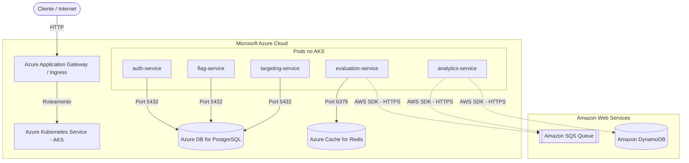

# Guia de Execução Local e Implantação na Nuvem (Microsoft Azure)
## Tech Challenge - Fase 02 (ToggleMaster)

Este guia contém as instruções de como **executar e testar localmente** a aplicação e como **implantá-la na Microsoft Azure (Opção B do PDF)** utilizando serviços gerenciados equivalentes.

---

## 💻 Parte 1: Execução e Teste Local (Passo a Passo)

Para validar a integridade de todos os microsserviços e a comunicação assíncrona localmente, siga os passos abaixo.

### 1. Preparação e Inicialização
Verifique se a rede local do Docker Compose e todos os containers estão ativos. Se necessário, inicie-os:
```bash
docker compose up -d
```

### 2. Semeadura de Chave de API (Seed)
Os microsserviços usam a chave `local-test-key` para se comunicarem. Precisamos inserir o hash SHA-256 dessa chave no banco de dados de autenticação (`db-auth`) para que ela seja validada:
```bash
docker compose exec -T db-auth psql -U user -d auth -c "INSERT INTO api_keys (name, key_hash) VALUES ('local-test-key', 'ed80667ec3d95b40e0d38f0ca5661b5c2765c1dd62682640d0976f20bbd8254a') ON CONFLICT DO NOTHING;"
```

### 3. Criação de Recursos no LocalStack (Fila e Tabela)
Como o LocalStack inicializa vazio no primeiro boot, crie manualmente a fila SQS e a tabela DynamoDB necessárias:
```bash
# Criar fila SQS
docker compose exec localstack awslocal sqs create-queue --queue-name my-queue

# Criar tabela DynamoDB
docker compose exec localstack awslocal dynamodb create-table \
  --table-name analytics-events \
  --attribute-definitions AttributeName=event_id,AttributeType=S \
  --key-schema AttributeName=event_id,KeyType=HASH \
  --provisioned-throughput ReadCapacityUnits=5,WriteCapacityUnits=5
```

### 4. Execução do Script Automatizado de Testes
Criamos um script automatizado [test-local.py](file:///home/torres/Downloads/FIAP-Fase2/test-local.py) na raiz do projeto. Rode-o para validar todo o fluxo de ponta a ponta:
```bash
python3 test-local.py
```

**O que o script faz:**
1. Valida o **Health Check** de todas as APIs (Portas 8001 a 8005).
2. Cria uma **Feature Flag** no `flag-service`.
3. Associa uma **Regra de Targeting por Porcentagem** (75%) no `targeting-service`.
4. Efetua **10 avaliações de flags** com usuários distintos no `evaluation-service`.
5. Valida o processamento assíncrono: o `evaluation-service` envia os eventos de acesso para o SQS, o `analytics-service` consome as mensagens da fila, grava-as no DynamoDB e limpa a fila. O script scaneia o banco e exibe o JSON do item persistido.

---

## ☁️ Parte 2: Implantação na Nuvem Microsoft Azure

No Azure, o cluster do **AKS (Azure Kubernetes Service)** orquestrará a aplicação. Como o código-fonte original está acoplado ao SDK da AWS para as chamadas de SQS e DynamoDB (`boto3` e AWS SDK Go), existem duas estratégias viáveis de arquitetura para implantação no Azure sem a necessidade de reescrever o código.

---

### 🏛️ Mapeamento de Serviços AWS para Azure

| Recurso AWS | Recurso Azure Equivalente | Descrição |
| :--- | :--- | :--- |
| **AWS EKS** | **Azure Kubernetes Service (AKS)** | Orquestração do cluster de containers |
| **AWS ECR** | **Azure Container Registry (ACR)** | Armazenamento de imagens Docker privadas |
| **AWS RDS PostgreSQL** | **Azure Database for PostgreSQL (Flexible Server)** | Bancos relacionais para Auth, Flags e Targeting |
| **AWS ElastiCache Redis** | **Azure Cache for Redis** | Cache de alta velocidade para o Evaluation Service |
| **AWS SQS** | **Amazon SQS** *(Estratégia 1)* ou **LocalStack no AKS** *(Estratégia 2)* | Mensageria assíncrona |
| **AWS DynamoDB** | **Amazon DynamoDB** *(Estratégia 1)* ou **LocalStack no AKS** *(Estratégia 2)* | Banco NoSQL de eventos analíticos |

---

### 📐 Estratégia 1: Arquitetura Híbrida / Multi-Cloud (Recomendada)
**Onde roda o quê:** O processamento, o cache e os bancos PostgreSQL rodam no **Azure**, e o SQS/DynamoDB são consumidos do **AWS pessoal**.
- **Vantagem:** Permite o reaproveitamento de código 100% íntegro sem alterações no código-fonte dos microsserviços. Os pods no AKS autenticam-se com o AWS IAM através de variáveis de ambiente injetadas por Kubernetes Secrets (`AWS_ACCESS_KEY_ID`, `AWS_SECRET_ACCESS_KEY`).



---

### 🛠️ Passo a Passo para Implantação no Azure (Estratégia 1)

#### 0. Registrar Provedores de Recursos (Obrigatório)
Se esta for uma nova assinatura do Azure, é necessário registrar os provedores de recursos para evitar o erro `MissingSubscriptionRegistration`:
```bash
# Registrar Container Registry (ACR)
az provider register --namespace Microsoft.ContainerRegistry

# Registrar Kubernetes Service (AKS)
az provider register --namespace Microsoft.ContainerService

# Registrar PostgreSQL Flexible Server
az provider register --namespace Microsoft.DBforPostgreSQL
```

#### 1. Provisionando o Registro de Imagens (Azure ACR)
Crie o Azure Container Registry e envie suas imagens locais:
```bash
# Criar grupo de recursos
az group create --name toggle-master-rg --location eastus

# Criar registro de contêiner
az acr create --resource-group toggle-master-rg --name togglemasterregistry --sku Basic

# --- Opção A: Usando Azure Cloud Shell (Recomendado - não precisa de Docker local) ---
# O ACR build envia o código para a nuvem da Azure e compila lá diretamente.
az acr build --registry togglemasterregistry --image auth-service:latest ./auth-service
az acr build --registry togglemasterregistry --image flag-service:latest ./flag-service
az acr build --registry togglemasterregistry --image targeting-service:latest ./targeting-service
az acr build --registry togglemasterregistry --image evaluation-service:latest ./evaluation-service
az acr build --registry togglemasterregistry --image analytics-service:latest ./analytics-service

# --- Opção B: Usando terminal local com daemon do Docker ---
# az acr login --name togglemasterregistry
# docker tag auth-service:latest togglemasterregistry.azurecr.io/auth-service:latest
# docker push togglemasterregistry.azurecr.io/auth-service:latest
```

#### 2. Provisionando o Cluster AKS
Crie o cluster AKS habilitando a integração automática com o ACR criado:
```bash
az aks create \
    --resource-group toggle-master-rg \
    --name toggle-master-aks \
    --node-count 2 \
    --generate-ssh-keys \
    --attach-acr togglemasterregistry \
    --node-vm-size Standard_D2s_v3
```
Após a criação, baixe o contexto do Kubernetes para a sua máquina:
```bash
az aks get-credentials --resource-group toggle-master-rg --name toggle-master-aks
```

#### 3. Provisionando Bancos de Dados no Azure
Crie a instância gerenciada do PostgreSQL no Azure (Flexible Server):
```bash
az postgres flexible-server create \
    --resource-group toggle-master-rg \
    --name togglemaster-db \
    --location eastus \
    --admin-user postgresuser \
    --admin-password MinhaSenhaSeguraAqui \
    --sku-name Standard_B1ms \
    --tier Burstable \
    --version 15
```
> [!IMPORTANT]
> Habilite a regra de firewall do servidor PostgreSQL para aceitar conexões vindas do bloco CIDR da subnet/VNet do AKS.
> Crie as três bases de dados (`auth`, `flags`, `targeting`) conectando via cliente SQL.

Crie o cache Redis gerenciado no Azure:
```bash
az redis create \
    --resource-group toggle-master-rg \
    --name togglemaster-cache \
    --location eastus \
    --sku Basic \
    --vm-size c0
```

#### 4. Configurando Segredos do Kubernetes no AKS
Crie o arquivo contendo todas as strings de conexões apontando para os recursos do Azure e insira as credenciais do AWS IAM (do seu AWS pessoal) para que os microsserviços consigam se autenticar no SQS/DynamoDB remotos.

Crie o manifesto `secrets.yaml`:
```yaml
apiVersion: v1
kind: Secret
metadata:
  name: toggle-master-cloud-secrets
  namespace: toggle-master
type: Opaque
data:
  # Endpoints do Azure PostgreSQL (codificado em base64)
  DATABASE_URL_AUTH: cG9zdGdyZXNxbDovL3Bvc3RncmVzdXNlcjpNaW5oYVNlbmhhU2VndXJhQWhlYWRA...
  DATABASE_URL_FLAGS: cG9zdGdyZXNxbDovL3Bvc3RncmVzdXNlcjpNaW5oYVNlbmhhU2VndXJhQWhlYWRA...
  DATABASE_URL_TARGETING: cG9zdGdyZXNxbDovL3Bvc3RncmVzdXNlcjpNaW5oYVNlbmhhU2VndXJhQWhlYWRA...
  
  # Endpoint do Azure Cache for Redis
  REDIS_URL: cmVkaXM6Ly86c2VuaGFAZG9wLXJlZGlzLmNhY2hlLndpbmRvd3MubmV0OjYzNzk=

  # Credenciais do AWS Pessoal para acesso SQS/DynamoDB
  AWS_ACCESS_KEY_ID: QUtJQVRFU1R...
  AWS_SECRET_ACCESS_KEY: U2VjcmV0S2V5SGVyZQ==
```
Aplique os manifestos no cluster AKS:
```bash
kubectl create namespace toggle-master
kubectl apply -f secrets.yaml
```

#### 5. Configuração do Ingress no AKS
Instale o Nginx Ingress Controller no AKS via Helm:
```bash
helm upgrade --install ingress-nginx ingress-nginx \
  --repo https://kubernetes.github.io/ingress-nginx \
  --namespace ingress-nginx --create-namespace \
  --set controller.service.annotations."service\.beta\.kubernetes\.io/azure-load-balancer-resource-group"="toggle-master-rg"
```
Isso criará um **Public IP** e um **Load Balancer** na nuvem Azure. Aponte o seu arquivo `ingress.yaml` com as regras de roteamento (ex: `/auth` -> `auth-service:8001`) para o AKS.

---

### 📈 Escalonamento no Azure (KEDA com SQS)
Instale o KEDA no AKS para gerenciar o autoescalamento orientado a eventos da fila SQS:
```bash
helm upgrade --install keda kedacore/keda \
  --repo https://kedacore.github.io/charts \
  --namespace keda --create-namespace
```

Use o seguinte `ScaledObject` para escalar o `analytics-service` baseado na fila SQS no AWS Pessoal. O KEDA lê os segredos do Kubernetes para autenticação na AWS:

```yaml
apiVersion: keda.sh/v1alpha1
kind: ScaledObject
metadata:
  name: analytics-service-scaler
  namespace: toggle-master
spec:
  scaleTargetRef:
    apiVersion: apps/v1
    kind: Deployment
    name: analytics-service
  minReplicas: 0
  maxReplicas: 5
  triggers:
    - type: aws-sqs-queue
      metadata:
        queueURL: https://sqs.us-east-1.amazonaws.com/123456789012/my-queue
        queueLength: "5"
        awsRegion: us-east-1
      authenticationRef:
        name: aws-sqs-auth
---
apiVersion: keda.sh/v1alpha1
kind: TriggerAuthentication
metadata:
  name: aws-sqs-auth
  namespace: toggle-master
spec:
  secretTargetRef:
    - parameter: awsAccessKeyID
      name: toggle-master-cloud-secrets
      key: AWS_ACCESS_KEY_ID
    - parameter: awsSecretAccessKey
      name: toggle-master-cloud-secrets
      key: AWS_SECRET_ACCESS_KEY
```

---

## 🧹 Limpeza de Recursos (Azure)
Para evitar custos desnecessários em sua conta após os testes do Tech Challenge, exclua o grupo de recursos inteiro:
```bash
az group delete --name toggle-master-rg --yes --no-wait
```
